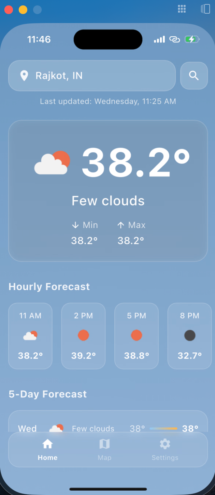
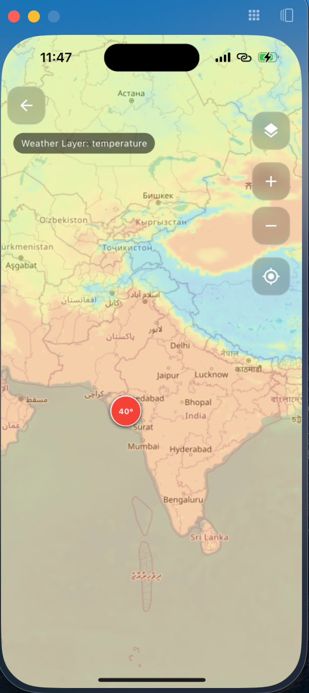

# Weather App

A comprehensive Flutter weather application that displays current weather conditions, hourly & five-day forecasts, with interactive weather maps.

## Features

- **Current Weather**: View detailed current weather information including temperature, humidity, wind speed, and more.
- **5-Day Forecast**: Access weather predictions for the upcoming five days.
- **Interactive Weather Map**: Explore weather conditions across different regions with an interactive map interface.
- **Location Options**: Get weather for your current GPS location or search for any city worldwide.

## Tech Stack

- **Flutter**: UI framework for cross-platform development
- **BLoC/Cubit**: State management pattern for predictable application behavior
- **flutter_dotenv**: For secure API key management
- **flutter_map**: Interactive map implementation (alternative to Google Maps)
- **http**: For API requests to OpenWeatherMap
- **OpenWeatherMap API**: Weather data provider

## Project Architecture

### Directory Structure

```
lib/
├── core/
│   ├── extensions/
│   ├── views/
├── data/
│   ├── models/
│   ├── services/
│       └── open_weather_service.dart
├── domain/                             # will contains entities and all.
├── features/
│   ├── screens/
│       ├── bloc/
│           ├── weather_cubit.dart
│           └── weather_state.dart
│       ├── widgets/
├── main.dart
└── .env                                # Environment configuration (not tracked in git)
```

### State Management

The application follows the BLoC/Cubit pattern for state management:

- **WeatherCubit**: Manages the state of weather data, handles loading, success, and error states.

### Data Flow

1. User interacts with the UI
2. Cubit processes the interaction
3. Service layer makes API calls to OpenWeatherMap
4. Data is parsed and returned as model objects
5. UI updates based on new state

## Setup Instructions

### Prerequisites

- Flutter SDK (3.27.0 or later)
- Dart SDK (3.6.0 or later)
- OpenWeatherMap API key

### Installation

1. Clone the repository:
   ```bash
   git clone https://github.com/jc-27901/weather_app_flutter
   cd weather_app_flutter
   ```

2. Install dependencies:
   ```bash
   flutter pub get
   ```

3. Set up environment variables:
    - Create a `.env` file in the project root with the following content:
      ```
      OPENWEATHER_API_KEY=your_api_key_here
      ```
    - Replace `your_api_key_here` with your actual OpenWeatherMap API key

4. Run the application:
   ```bash
   flutter run
   ```
### APK Link
   - https://github.com/jc-27901/weather_app_flutter/releases/download/untagged-4084e82e13218a73c483/app-release.apk

## API Key Security

This project uses the following approach to securely manage API keys:

1. API keys are stored in a `.env` file that is excluded from version control via `.gitignore`
2. The `flutter_dotenv` package loads these environment variables at runtime
3. The `OpenWeatherService` accesses the API key securely through this environment

**Important**: Never commit your `.env` file to version control.

## OpenWeatherService

The application includes a custom `OpenWeatherService` that provides a unified interface for all OpenWeatherMap API interactions. This service:

- Handles all weather data fetching and processing
- Supports both location-based and city-based queries
- Implements proper error handling
- Provides typed data models for weather information

## Map Implementation

The application uses `flutter_map` (based on Leaflet.js) instead of Google Maps due to:

- No credit card requirement
- Free usage tier sufficient for this application
- Comprehensive API that supports all required features:
    - Weather overlays
    - Location markers
    - Interactive zooming and panning
  

## Trade-offs and Decisions

1. **State Management**: Chose BLoC/Cubit over Provider/Riverpod for its structured approach to state management and better handling of complex state transitions.

2. **Maps Implementation**: Used `flutter_map` instead of Google Maps to avoid credit card requirements while still providing essential mapping functionality.

3. **Weather Service Abstraction**: Created a dedicated service layer to abstract API calls, allowing for easier testing and potential API changes in the future.

4. **Language Support**: Limited initial language support to English and Hindi for MVP, with architecture supporting easy addition of more languages.

## Screenshots

**Demo Video Link**: https://drive.google.com/drive/folders/1EoHVkBAVB48mqTCXeopXerKkhmC1oHcE?usp=sharing

__
__


## Acknowledgments

- OpenWeatherMap for providing the weather data API
- Flutter Map contributors for the mapping library
